<div align="center">


<a href="https://zacharychung.vercel.app">
  
</a>

<p>
  
  <a href="https://github.com/ZacharyTChung?tab=followers">
    
  </a>
  
  
  
</p>

</div>

---

## Hi, I'm Zachary

Software engineer in LA, happy to relocate for the right opportunity. I like taking an idea from a sticky note to something real — full-stack apps, mobile, and a bit of low-level systems work when the problem calls for it.

Most of what I build started with a problem I ran into myself. When I'm not at a screen, I'm probably swimming, biking, or running — chasing a half Ironman in December. The reason I like long-distance training is the same reason I like building things: small, boring days that quietly add up to something you couldn't do a few months back.

```yaml
role:        Software Engineer
location:    Los Angeles, CA  (open to relocating)
education:   CS + Business Administration @ USC
focus:       [full-stack, mobile, low-level systems, AI/ML]
chasing:     Ironman 70.3 La Quinta · 2026-12-06
ask-me-about: shipping side projects, hiking, the next trip
```

## Toolkit

> A working set, not a wishlist. These are the tools I've actually shipped with — and the ones I keep coming back to.

<div align="center">

**Languages**


**Mobile / Frontend**


**Backend / Infra**


**Systems**


**AI Tools**


**Other**


</div>

## Selected Work

<table>
<tr>
<td width="50%" valign="top">

### Agentic Automation for iOS Accessibility
<sub>**Apr 2026** · 3rd Place · SoCal Claude Hackathon (UCLA · USC · Caltech)</sub>

Voice-driven AI iPhone agent that understands screen context, performs multi-step workflows across apps, and narrates each action in real time for blind and low-vision users.

`Swift` · `SwiftUI` · `Node.js` · `Claude API` · `XCTest` · `AVFoundation`

</td>
<td width="50%" valign="top">

### ProfBench
<sub>**Apr 2026 – present** · Author</sub>

Domain-specific LLM evaluation harness for procurement / source-to-pay reasoning. AfterQuery-style expert-in-the-loop authoring with Claude as autograder, plus loss analysis, leaderboard, and Hugging Face dataset export.

`Python` · `Claude API` · `Streamlit` · `Hugging Face` · `LLM Eval`

</td>
</tr>
<tr>
<td width="50%" valign="top">

### I/O Performance Study — mmap vs io_uring
<sub>**Dec 2025 – present** · Author</sub>

17 controlled experiments across 8 research phases comparing I/O strategies for analytical workloads. Identified NVMe queue saturation as a scaling limit and produced 5 actionable engineering recommendations.

`C++` · `Apache Arrow` · `Linux` · `io_uring` · `mmap`

</td>
<td width="50%" valign="top">

### Wandr
<sub>**Mar 2026 – present** · Built it</sub>

Full-stack mobile app for mapping and rating travel locations. EXIF auto-pinning, GPS dwell-time detection, presigned S3 uploads, and a geospatial PostGIS schema behind a Firebase Auth-protected API.

`React Native` · `TypeScript` · `Node.js` · `PostgreSQL/PostGIS` · `AWS S3` · `Firebase` · `Mapbox GL`

</td>
</tr>
</table>

## GIT INVADERS

> Every commit on your contribution graph becomes an alien — color-graded by intensity (1-2, 3-5, 6-9, 10+). A ship at the bottom slides and fires; explosions pop on real commit cells. Regenerated daily by a GitHub Action so the formation reshapes itself as new commits land.

<div align="center">



</div>

## GitHub Stats

<div align="center">

<a href="https://github.com/ZacharyTChung">
  
  
</a>

<a href="https://git.io/streak-stats">
  
</a>


</div>

## Off the Clock

| | |
|---|---|
| ⚽ **Soccer** | Played since I was a kid. Pickup, leagues, the occasional couch match. |
| ✈️ **Travel** | I'll go pretty much anywhere new — usually for the food and the people. |
| 🏊 **Training** | Swim, bike, run. Most days it's just the work of showing up. |
| 🥾 **Hiking** | Sierras, desert, anywhere with elevation. Most weekends. |
| 🏃 **Running** | Easy miles before the city wakes up. Nothing fixes a bad day like a long run. |

## What I'm Chasing

> Big goals keep me honest. Right now: my first half Ironman — a 1.2-mile swim, 56-mile bike, 13.1-mile run. There's no shortcut. You just keep showing up. Same goes for most of what I build. The interesting parts are almost always in the boring middle.

<div align="center">


</div>

## Connect

<div align="center">

<a href="https://zacharychung.vercel.app">
  
</a>
<a href="https://www.linkedin.com/in/zacharychung">
  
</a>
<a href="mailto:zchung@usc.edu">
  
</a>
<a href="https://github.com/ZacharyTChung">
  
</a>

</div>

<div align="center">

---

<sub><i>Built between training sessions.</i></sub>


</div>
